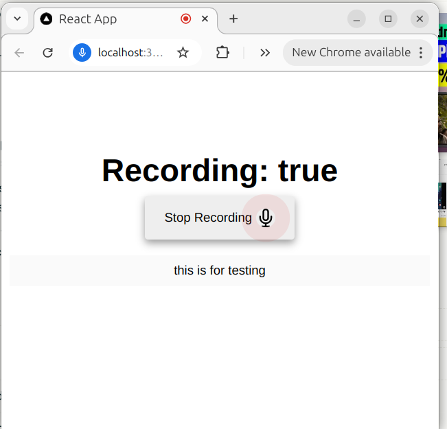

# It works only for Nodejs version 16, install it using nvm

```
nvm install 16
```

# Install dependeces using

```
npm install
```

# Run project locally

```
npm run start
```

# Building project locally

Code will be output to the `/dist` folder using rollup bundler

```
npm run build
```

This is the output when you run the app


